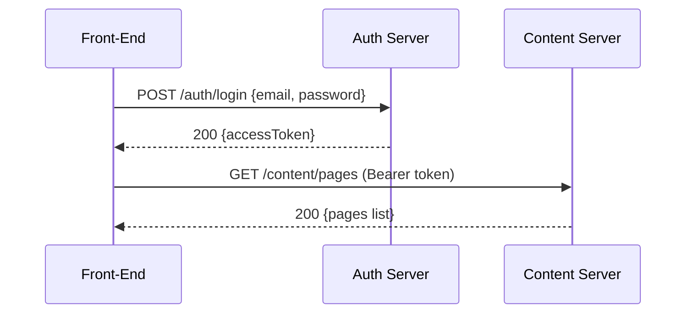

# Back-End Microservices Overview

Within this `back-end/` directory, you’ll find two standalone Node.js microservices that collectively support the CMS App front-end:

``` shell
back-end/
├── auth-server/         # Authentication & User Management
├── content-server/      # CMS Content Management
└── README.md            # High-level overview (this file)
```

Each service follows a similar structure (Express + TypeScript + TypeORM + PostgreSQL) but focuses on distinct domain responsibilities.

---

## 1. Service Summaries

| Service             | Description                                                       | Port  | Database      | Main Technologies                          |
| ------------------- | ----------------------------------------------------------------- | ----- | ------------- | -------------------------------------------|
| **Auth Server**     | User signup/login, JWT issuance & refresh tokens, profile APIs    | 3000  | cms_auth      | Express, TypeORM, PostgreSQL, Bcrypt, JWT   |
| **Content Server**  | CRUD operations for pages/posts, file uploads, pagination, RBAC   | 3001  | cms_content   | Express, TypeORM, PostgreSQL, Multer, RBAC  |

---

## 2. Interaction Workflow

1. **Authentication**
   - Front-End → Auth Server: `POST /auth/register` or `POST /auth/login`
   - Auth Server → Front-End: `200 OK` + `{ accessToken }`
2. **Content Access**
   - Front-End includes ` Bearer <bearer_token>` cookie on content requests
   - Front-End → Content Server: any protected endpoint (e.g., `GET /content/pages`)
   - Content Server validates JWT (via secret or public key) before granting access



---

## 3. Quickstart Setup

### Clone & Install

```bash
git clone <repo-url>
cd back-end
# Install both services
for svc in auth-server content-server; do (
  cd "$svc" && npm install
); done
```

### Configuration

Copy each `.env.example` to `.env` and customize:

- **Auth Server** (`auth-server/.env`)

  ```env
  PORT=3001
  DB_HOST=localhost
  DB_PORT=5432
  DB_USER=postgres
  DB_PASS=<your_password>
  DB_NAME=cms_auth
  JWT_SECRET=<your_jwt_secret>
  JWT_EXPIRATION=1h
  ```

- **Content Server** (`content-server/.env`)

  ```env
  PORT=5000
  DB_HOST=localhost
  DB_PORT=5432
  DB_USER=postgres
  DB_PASS=<your_password>
  DB_NAME=cms_content
  JWT_PUBLIC_KEY_PATH=../auth-server/keys/public.pem
  ```

### Run Database Migrations

```bash
cd auth-server && npm run migration:run
cd ../content-server && npm run migration:run
```

### Start Services

```bash
# In separate terminals or via process manager
cd auth-server && npm run dev
cd content-server && npm run dev
```

- **Auth**: <http://localhost:3000>
- **Content**: <http://localhost:3001>

---

## 4. Production & Deployment

- **Docker**: Each service includes a `Dockerfile`.
- **CI/CD**: Pipeline per service: lint → test → build → push → deploy.
- **Secrets Management**: Use secure vaults for env vars and JWT keys.

---

## 5. Observability & Health

- **Logging**: Structured via Winston/Pino.
- **Health Checks**: `GET /health` for each service.
- **Metrics**: Integrate Prometheus or APM.

---

## 6. Documentation

For full API routes, schemas, and examples:

- [Auth Server README](auth-server/README.md)
- [Content Server README](content-server/README.md)
